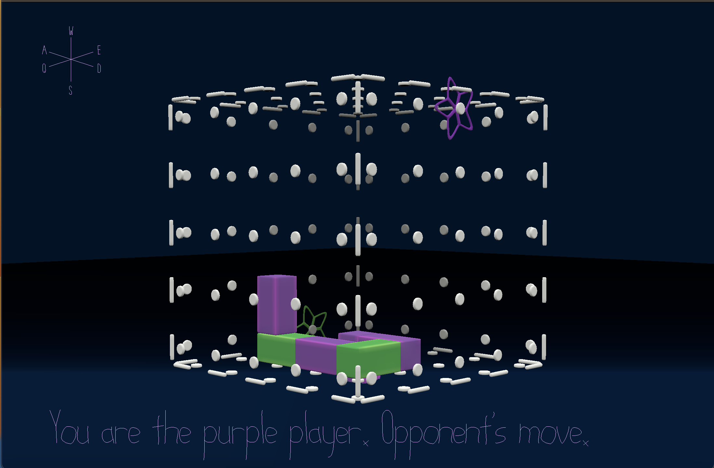

# Phototropic

Author: Sasha Mishkin

Design: A vine grows simultaneously in two colors, and with conflicting desires, each wishing to follow a different light. Two players take turns making the vine grow toward the goal (flower icon) of their assigned color. 

Networking: The game is turn-based and requires exactly two players. The server waits for both players to join before allowing players to move (and randomizing the flowers' positions). Then, the server keeps track of whose turn it is, and each player's move is treated as a command (with a letter representing direction as payload) which the server then broadcasts to all players to update game state (vine positions).

Screen Shot:

How To Play: Create exactly two clients (I have not tested what happens with more than two clients; it may be very buggy). Purple player always moves first. Use W, A, S, D, Q, and E keys to move as indicated on the screen. Try to reach the flower of your color and prevent your opponent from reaching the flower of *their* color. If both players reach the flowers of their color simultaneously (e.g. if they are at a corner), both players win. Currently there is no way to resolve a stalemate situation, though.

Sources: None

This game was built with [NEST](NEST.md).

